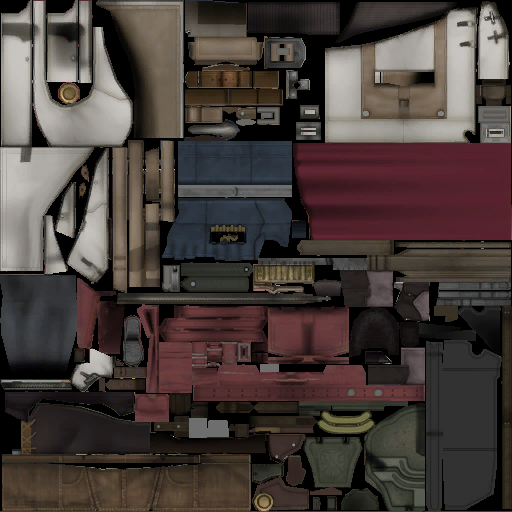
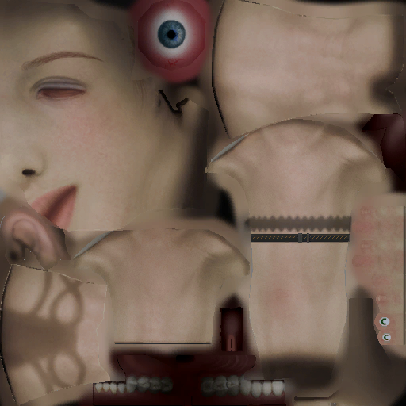
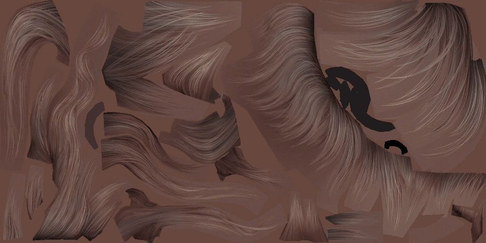

# IMGBlibrary
This C# reference library contains functions for dealing with different types of image headers from the FINAL FANTASY XIII trilogy. 

This particular version is designed to be used with .net framework projects. you can get the .net core version of this library from [here](https://github.com/Surihix/IMGBlibrary_Core).

# Sample Images
**Legal bit:** Images linked below are property of Square Enix.

  
 
 
 
 

### Important
- Repacking is supported only for the PC version IMGB files.
- This library does not support unswizzling the Xbox 360 version mip data. the unpacking function will extract the mips without unswizzling them.
- Refer to this [page](https://github.com/Surihix/IMGBlibrary/blob/master/LibraryUsage.md) for information about using the functions, supported by this library. 

This library is used extensively in these following programs:
- **TRBtool** - https://github.com/Surihix/TRBtool
- **WPDtool** - https://github.com/Surihix/WPDtool
